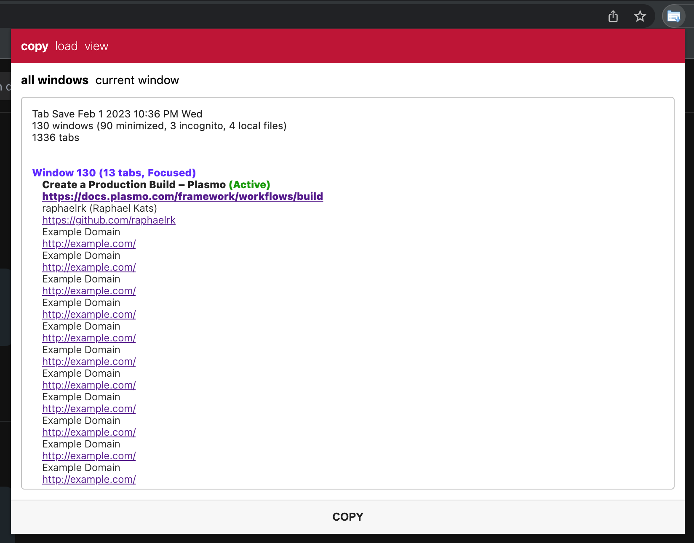

Easily save all your tabs!

- the `copy` tab lets you copy a list of all your tabs to your clipboard and works great for pasting into the mac notes app
- the `load` tab lets you paste a list of windows/tabs and open them all at once
- the `view` tab lets you look through all your tabs

(I did in fact have 1336 tabs open when I took this screenshot)

---

### Installation

- open [chrome://extensions/](chrome://extensions/)
- enable "Developer mode"
- click "Load unpacked"
- select the `build/chrome-mv3-prod` directory in this repository

### Development

- Uses [plasmo](https://plasmo.com) for extension development. [Plasmo docs](https://docs.plasmo.com/framework)
- `npm install -g pnpm`
- `pnpm install`
- `pnpm dev`
- open [chrome://extensions/](chrome://extensions/)
- enable "Developer mode"
- click "Load unpacked"
- select the `build/chrome-mv3-dev` directory in this repository

You can also [get it on the Chrome Web Store](https://chrome.google.com/webstore/detail/tabsave/ejmellidbiganikdjemjajgfckidgnpe) but it's not currently up to date
